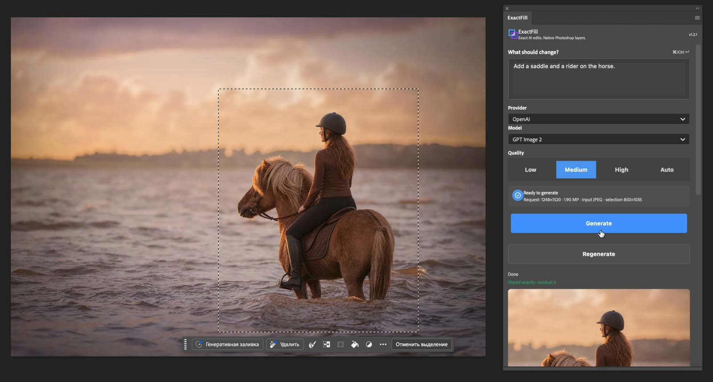

# ExactFill для Photoshop

[English version](README.md)

Точне AI-редагування саме в обраній області.

ExactFill — безкоштовний плагін Photoshop із відкритим кодом, який напряму
підключається до OpenAI та Google Gemini через ваші власні API-ключі. Виділіть
область, опишіть зміну — і отримайте результат як точно розміщений Smart Object
із нативною маскою шару Photoshop.

> Без реєстрації, сервера ExactFill і внутрішніх кредитів. Ви платите напряму
> AI-провайдеру й бачите оцінку витрат API у самому плагіні.

## Демо

[](https://zgmrclick.github.io/exactfill-photoshop/)

Спробуйте [інтерактивне порівняння до/після](https://zgmrclick.github.io/exactfill-photoshop/)
або подивіться [22-секундний запис Photoshop](docs/assets/exactfill-demo.mp4). Демо
використовує справжнє виділення й показує результат як точно розміщений шар.

## Чому ExactFill

- Точне розміщення в початковому виділенні, включно з непарними й дробовими межами.
- Неруйнівний Smart Object і нативна маска шару Photoshop.
- RGB, CMYK, Grayscale та Lab; 8/16/32-бітні документи не конвертуються.
- OpenAI GPT Image (разом із GPT Image 2.5) і Google Gemini в одній панелі.
- Змішування краю, контекст, референси, прозорий фон і вхід без втрат.
- Проміжні кадри OpenAI, коли API та UXP підтримують потокову відповідь.
- Постійна статистика витрат, історія, пресети та локальний кеш результатів.
- Український та англійський інтерфейс.

## Встановлення

Завантажте `ExactFill-1.5.0.zip` зі сторінки
[Releases](https://github.com/zgmrclick/exactfill-photoshop/releases), повністю
розпакуйте архів і закрийте Photoshop.

### Windows

Скопіюйте цілу папку `ExactFill` до папки `Plug-ins` вашого Photoshop, наприклад:

```text
C:\Program Files\Adobe\Adobe Photoshop 2026\Plug-ins\ExactFill
```

### macOS

Скопіюйте цілу папку `ExactFill` до папки `Plug-ins` вашого Photoshop, наприклад:

```text
/Applications/Adobe Photoshop 2026/Plug-ins/ExactFill
```

Запустіть Photoshop і відкрийте **Plugins → ExactFill**. У кінцевій папці
`ExactFill` файл `manifest.json` має лежати безпосередньо всередині. Якщо оновлюєте
приватну збірку **AI Image**, замініть її стару папку `AiImagePS`, а не залишайте
обидві копії.

## Перший запуск

1. Відкрийте документ і створіть виділення.
2. Виберіть OpenAI або Google Gemini та вставте API-ключ цього провайдера.
3. Опишіть потрібну зміну й натисніть **Генерувати**.
4. Перевірте новий Smart Object і за потреби відкоригуйте його маску.

API-ключі зберігаються через Photoshop UXP `secureStorage`. Виділені пікселі,
промпт і додаткові референси надсилаються напряму вибраному провайдеру. Докладніше —
у [політиці приватності](PRIVACY.md).

## Вартість

ExactFill безкоштовний. OpenAI і Google можуть стягувати плату за використання API.
Плагін веде локальний журнал і показує оцінку вартості в USD, коли у відповіді API
достатньо даних. Ціни й доступність моделей можуть змінюватися; рахунок провайдера
завжди є остаточним.

## Сумісність

- Adobe Photoshop 2024 або новіший (`25.0+`).
- Для Windows і macOS використовується один і той самий плагін.
- Потрібні інтернет і API-ключ вибраного провайдера.
- Фінальну поведінку на Windows слід перевіряти у справжньому Photoshop на Windows.

### Фаєрволи та проксі

ExactFill підключається до провайдера напряму з Photoshop/UXP через HTTPS. Якщо
фаєрвол, проксі або захисна політика обмежує Photoshop, дозвольте вихідний
TCP-порт 443 до домену потрібного провайдера:

- OpenAI: `api.openai.com`
- Google Gemini: `generativelanguage.googleapis.com`

Мережевий дозвіл у `manifest.json` діє лише всередині UXP-пісочниці; плагін не
може змінити або обійти системний фаєрвол. На macOS додайте ці домени до дозволів
для Photoshop/Adobe UXP у своїй програмі мережевої фільтрації. На Windows
перевірте **Windows Defender Firewall with Advanced Security → Outbound Rules**
і сторонні фаєрволи. [За правилами Microsoft](https://learn.microsoft.com/en-us/windows/security/operating-system-security/network-security/windows-firewall/rules#rule-precedence-for-inbound-and-outbound-rules)
явний `Block` має пріоритет над суперечливим `Allow`, тому загальне блокування
Photoshop треба вимкнути або замінити політикою, що підтримує потрібні винятки за
доменами. Не використовуйте сталі IP-адреси: адреси провайдерів можуть змінюватися.

Така сама двомовна інструкція є в `INSTALL.txt` кожного релізу.

## Помилки й підтримка

Скористайтеся формою **Повідомити про помилку** в панелі або створіть
[GitHub Issue](https://github.com/zgmrclick/exactfill-photoshop/issues/new/choose).
Форма може додати версію, ОС, провайдера, модель і налаштування, але не додає
API-ключі, промпти, назви документів, шляхи, зображення чи історію використання.

ExactFill безкоштовний і має відкритий код. Якщо він заощаджує вам час,
[підтримайте розробку на Ko-fi](https://ko-fi.com/havryil89140). Також допомагають
зірка на GitHub, корисний звіт про помилку, коротке демо або рекомендація колезі.

## Розробка

Встановлювати npm-залежності не потрібно:

```bash
npm test
npm run build
```

Ліцензія: [MIT](LICENSE).
